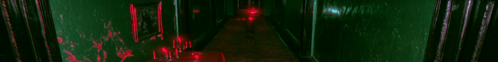

# CONSPACE ROOMS

**Live:** https://conspace-rooms.vercel.app/ (RU / EN)

A walk-through web installation by [Sinaida](https://sinaida.eu/) and
[UVALISS](https://uvaliss.ru/) (Alisa Feer). Eighteen works from the SOULS series
by UVALISS hang in a labyrinth of half-lit rooms that the browser builds as you
walk. There is no map and no signage. A rose in the corner grows with every work
you meet; find all eighteen and an arch of roses lets you out. Put on headphones
and go slowly.

## What it is about

SOULS is a series about looking into your own inner world and accepting it as it
is. The labyrinth walks the same road: hospital corridors of fear, then a
grandmother's flat full of memory, then pale rooms that dissolve into lace and
light. The works hang wherever the corridors happen to put them, so every visit
meets them in a different order.

## The vibe

Half-remembered late Soviet interiors: green oil paint under whitewash, humming
tubes, rugs on the walls, a television left on in an empty room, beds and drip
stands the hospital left behind. Liminal-space stillness with a green terminal
screen for a front door. Candles are the map, a rare door gives way for a moment
if you stand still in front of it, every work hums its own note, and the music is
generated as you walk and never quite the same twice (each piece picks its own
key, tempo and harmony). In the hospital, lo-fi piano with a ward monitor, 80s
Soviet synth and a basement techno heard through concrete take turns, and a radio
sometimes breaks through with the time signal. In grandmother's world gramophone
records play everywhere, as if from the next flat, and close in her room: a
waltz, a tango on a bayan, a 70s estrada ballad, a romance on a guitar.

## Why it exists

Paintings usually wait in rooms you have to travel to. This one opens in any
browser, on a laptop or a phone, and you meet the works alone, at your own pace.
It keeps nothing about you: no analytics, no accounts, and the camera image
never leaves your device.

## Collaboration

UVALISS (Alisa Feer) is a visual artist from Saint Petersburg exploring themes of light and
darkness, childhood and dreams.

- Sinaida: [sinaida.eu](https://sinaida.eu/) · [@sin.ai.da](https://www.instagram.com/sin.ai.da)
- UVALISS: [uvaliss.ru](https://uvaliss.ru/) · [@uvaliss](https://www.instagram.com/uvaliss/)

## Controls

| Action                | Desktop (gestures)         | Desktop (keyboard)          | Mobile (light mode)          |
|------------------------|-----------------------------|-------------------------------|---------------------------------|
| Walk                   | both hands as fists         | W / ↑, S / ↓                  | hold top half of the screen     |
| Turn                   | point right hand = turn right, point left hand = turn left | ← / →, or mouse look (click to lock) | horizontal drag |
| Zoom                   | both palms open, spread/pinch the two hands | mouse wheel         | two-finger pinch (desktop-touch fallback) |
| Strafe                 | —                            | A / D                         | —                                |
| Inspect                | thumb-index pinch (either hand) | E or Space, click        | tap an artwork                  |
| Close inspect / stop   | both palms open              | Escape                        | tap again                       |

Gesture mode requests webcam access on entry (opt-in); if it's denied or unavailable the
experience falls back to keyboard controls automatically. Light mode is auto-suggested on
touch devices and runs at reduced quality (tier 0, tighter draw radius, no post-processing,
half-resolution artwork textures, no webcam).

## Run locally

```
python3 -m http.server 4800
```

Then open http://localhost:4800/ in a browser. Requires WebGL2.

## Deploy

Vercel, from `main` (root), no build step:
https://conspace-rooms.vercel.app/

Every push to `main` redeploys production.

All asset and module paths are relative, so the site works unmodified under a
subpath or at a domain root.

The old GitHub Pages address (https://sinaida-space.github.io/conspace-rooms/)
stays on and forwards every page to Vercel: a small script at the top of each
HTML page redirects any `github.io` host, keeping the path, `?lang` and hash.

## Soul path

The labyrinth follows the arc of the SOULS series, from trauma to accepting
oneself. Distance from spawn picks the zone (`src/zones.js`, blended in the
shaders in `src/materials.js`):

- **Fear** (0–45 m): hospital corridors, green oil paint under whitewash, damp,
  linoleum, cold tubes that flicker often.
- **Memory** (80–135 m): grandmother's flat, rosette wallpaper, rugs on the
  walls, parquet, warm lampshades.
- **Acceptance** (175 m and on): pale walls dissolving into lace and light.

`src/soulpath.js` moves the world from one stage to the next through portals,
and candles along the walls point the way. `src/ambience.js` gives every work
its own sound, `src/dust.js` hangs dust in the lamp beams. Shift runs.

Every visit builds a new labyrinth. The seed is the UTC date and time the page
opened, to the second (`src/world.js`), and from it follow the corridors, where
the works hang, the portals, doors and the order of the souls' questions. Two
visitors who arrive in the same second walk the same corridors. `?seed=<int>`
pins one labyrinth for testing.

## Gallery mode

`/gallery` runs the piece as an installation for a projector or a screen with a
webcam. There are no start screens, menus or buttons and the cursor is hidden.
An attract screen waits until the webcam sees a face for about a second; then the
walk starts and the visitor steers with their hands. When nobody has been in front
of the camera for a while (or the closing card has been up long enough), the
attract screen comes back and the page reloads into a new labyrinth for the next
visitor. The code is in `src/gallery.js`.

### Setting it up

1. A computer with a recent Chrome, a projector or screen, a webcam placed by the
   screen facing the visitor at about chest height, and speakers or headphones.
2. Light the visitor's face and hands from the front; the hand tracker needs to see
   both hands clearly at a step or two from the camera.
3. Start Chrome in kiosk mode so it opens full screen, plays sound and uses the
   camera without anyone clicking:

   ```
   chrome --kiosk --autoplay-policy=no-user-gesture-required --use-fake-ui-for-media-stream "https://conspace-rooms.vercel.app/gallery?lang=ru"
   ```

   On macOS: `/Applications/Google\ Chrome.app/Contents/MacOS/Google\ Chrome` with
   the same flags. Without kiosk mode, allow the camera once when Chrome asks (it
   remembers the site) and press `F` for full screen; the first key press or click
   also wakes the sound.
4. Test it: step in front of the camera, the walk should start; step away and after
   the idle time the attract screen should return.

### URL parameters

| Parameter | Default | What it does |
|-----------|---------|--------------|
| `lang`    | `ru`    | `ru` or `en` |
| `idle`    | `40`    | seconds with nobody in front before the walk resets (5–600) |
| `card`    | `25`    | seconds the closing card of questions stays up (5–300) |
| `volume`  | `0.9`   | master volume, 0 to 1 |
| `seed`    | time    | an integer for one fixed labyrinth instead of a new one per visitor |

Example: `/gallery?lang=en&idle=60&card=30&volume=0.7`

### Keys

| Key | What it does |
|-----|--------------|
| `F` | toggle full screen (when not in kiosk mode) |
| any key | enter with keyboard controls, if the camera is not available |

The cheats in [docs/CHEATS.md](docs/CHEATS.md) work here too. As in the ordinary
gesture mode, the camera image is processed only in the browser: nothing is
recorded or sent anywhere.

## Languages

The first screen asks for Russian or English. The choice is kept only in the
URL (`?lang=ru` / `?lang=en`), never in storage, so a link with `?lang=ru`
opens straight in Russian. All strings live in `src/i18n.js`. The text pages
(`tech.html`, `privacy.html`) hold both languages and switch the same way.

## Stack

- Vanilla JS (ES modules), no build step
- [Departure Mono](https://github.com/rektdeckard/departure-mono) by Helena Zhang (SIL OFL 1.1), self-hosted in `assets/fonts/`
- [three.js](https://threejs.org/) (vendored) for rendering
- Procedural GLSL materials; the labyrinth geometry uses no texture files
- Two CC0 models from [Poly Haven](https://polyhaven.com/) in `assets/models/` (Old Bed Frame, Wheelchair 01), simplified with glTF-Transform; every other hospital prop is drawn in `src/ward.js`
- [MediaPipe Tasks Vision](https://developers.google.com/mediapipe) hand landmarker for gesture mode (loaded lazily, opt-in)

## Rights

© Sinaida Krivchenko & UVALISS (Alisa Feer). Artworks all rights reserved.
